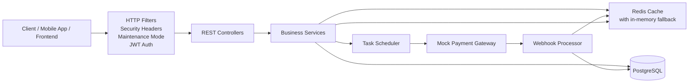
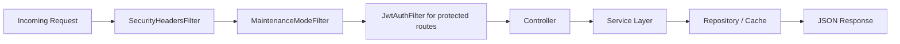
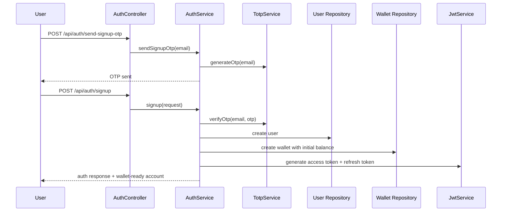
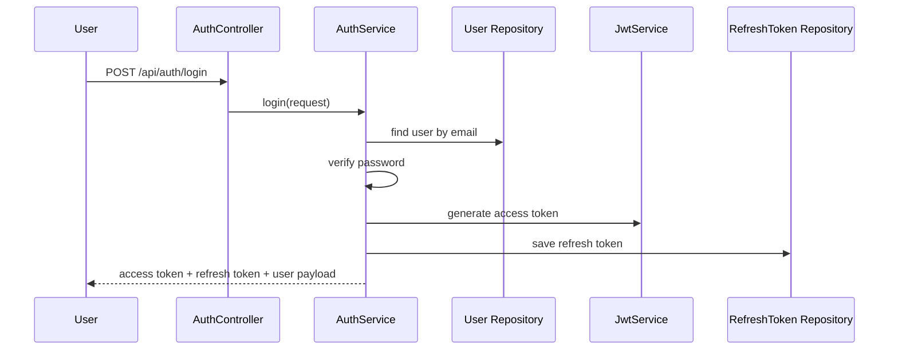
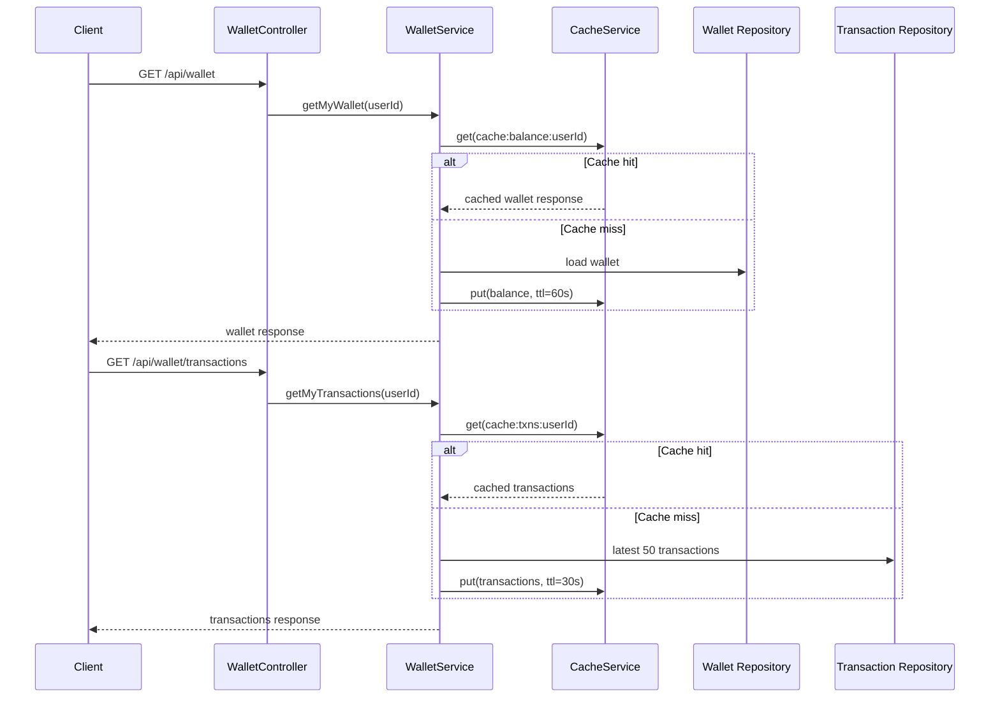
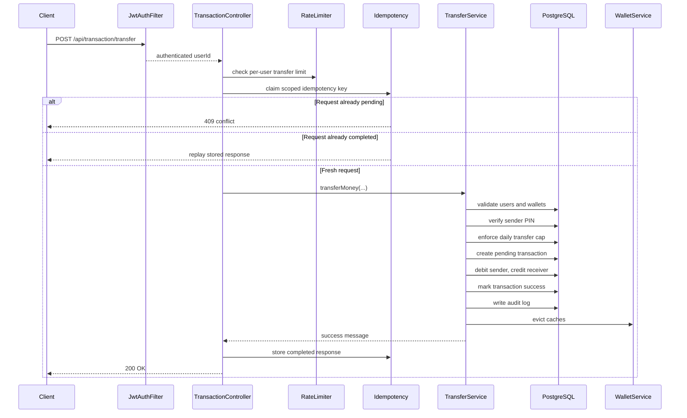
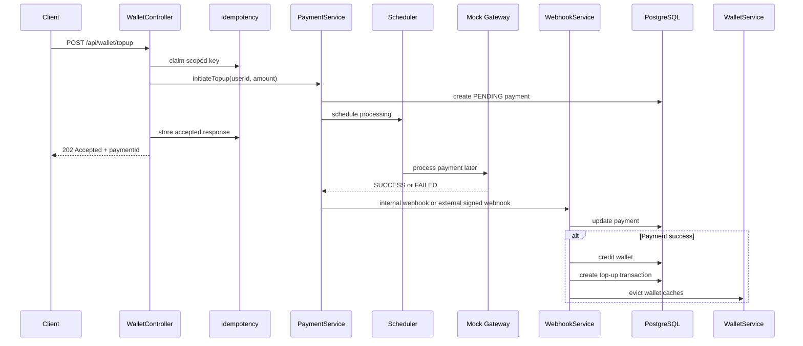
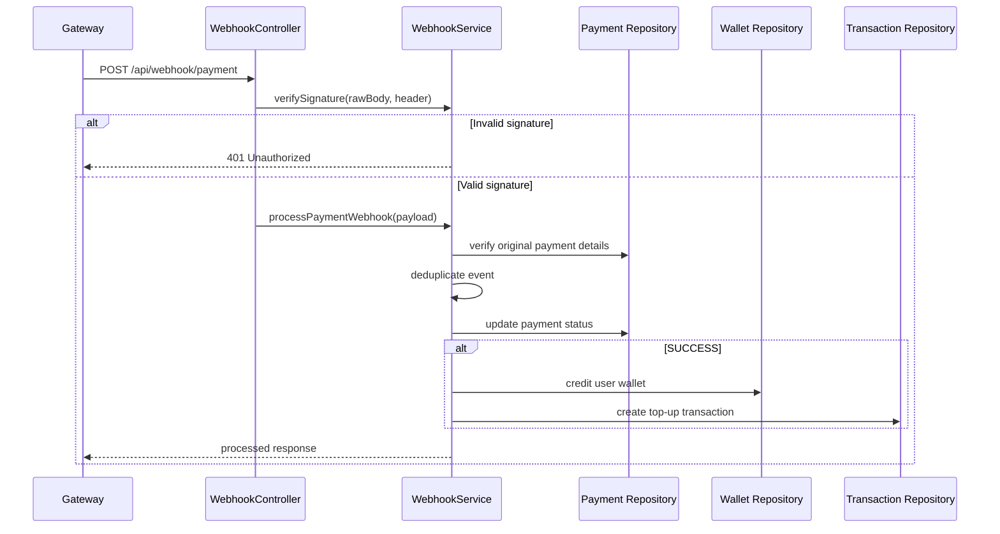

# PayPulse

PayPulse is a backend-first digital wallet system built with Spring Boot. It handles user onboarding, OTP-based verification, JWT authentication, wallet balance reads, peer-to-peer transfers, asynchronous wallet top-ups, signed webhooks, caching, and basic operational safeguards such as rate limiting, idempotency, maintenance mode, and a payment gateway circuit breaker.

The current repository contains the backend service in `backend/`. There is no frontend app in this project at the moment.

## What This Project Does

- Creates users and wallets with an initial signup balance
- Verifies ownership through OTP generation and validation
- Issues short-lived access tokens and persisted refresh tokens
- Supports secure wallet-to-wallet transfers with PIN verification
- Supports asynchronous wallet top-ups through a mock payment gateway flow
- Verifies payment webhooks using HMAC signatures
- Caches wallet balances and transaction history with Redis and in-memory fallback
- Protects sensitive routes with JWT auth, rate limits, and idempotency keys

## Tech Stack

- Java 21
- Spring Boot 3
- Spring Web
- Spring Validation
- Spring Data JPA
- PostgreSQL
- Spring Data Redis
- Resilience4j Circuit Breaker
- JWT via `jjwt`
- Maven
- Docker Compose
- H2 for integration-style tests

## Architecture At a Glance



## Request Lifecycle

Every API request moves through a predictable pipeline:



### Filter order

1. `SecurityHeadersFilter`
2. `MaintenanceModeFilter`
3. `JwtAuthFilter`

### What each filter does

- `SecurityHeadersFilter` adds browser-facing security headers.
- `MaintenanceModeFilter` blocks most routes when maintenance mode is enabled.
- `JwtAuthFilter` protects wallet, transfer, and selected auth routes by requiring `Authorization: Bearer <token>`.

## Core Domain Model

The main entities in the system are:

- `UserEntity`: account profile, hashed password, hashed PIN, role, active state
- `WalletEntity`: per-user wallet with currency, balance, status, and QR payload
- `TransactionEntity`: transfer and top-up ledger entries
- `PaymentEntity`: asynchronous top-up lifecycle record
- `RefreshTokenEntity`: persisted refresh tokens for session continuation
- `AuditLogEntity`: audit trail for transfer events

## Main Workflows

### 1. Signup Workflow

New users join the system through OTP verification and automatic wallet provisioning.



### Signup rules

- Email and username are normalized before persistence.
- OTP must be valid.
- Password is BCrypt-hashed.
- Transaction PIN is BCrypt-hashed.
- A wallet is created immediately after user creation.
- The user receives both an access token and a refresh token.

### 2. Login and Session Workflow

Users log in with email and password, then use JWTs for protected routes.



### Session behavior

- Access tokens are short-lived JWTs.
- Refresh tokens are random values stored in the database.
- `POST /api/auth/refresh` issues a new access token if the refresh token is valid.
- `POST /api/auth/logout` revokes the supplied refresh token.
- Password reset and password change revoke all refresh tokens for that user.

### 3. OTP Workflow

PayPulse uses a TOTP-style code generation strategy derived from:

- the configured OTP secret
- the normalized email
- the current time step

The code is currently logged by `MailService`, which makes local development easy. In production, this service should be replaced with a real email provider.

### 4. Wallet Read Workflow

Wallet and transaction history reads are cache-backed.



### Cache behavior

- Redis is the primary cache.
- If Redis becomes unavailable, `CacheService` falls back to an in-memory store.
- Wallet caches are evicted after successful transfers and successful top-ups.

### 5. Transfer Workflow

Transfers are synchronous, transactional, PIN-protected, rate-limited, and idempotent.



### Transfer protections

- Requires a valid Bearer token
- Requires `Idempotency-Key`
- Requires correct 6-digit transaction PIN
- Rejects self-transfers
- Rejects inactive users and inactive wallets
- Enforces a 24-hour transfer cap
- Applies rate limiting before execution

### 6. Top-Up Workflow

Top-ups are intentionally asynchronous to simulate a real payment gateway.



### Top-up behavior

- Requires a valid Bearer token
- Requires `Idempotency-Key`
- Returns `202 Accepted` because processing is deferred
- Uses a scheduler to simulate gateway delay
- Uses a circuit breaker around the gateway round-trip
- Supports either internal webhook handling or external webhook dispatch through `PAYMENT_WEBHOOK_URL`

### 7. Webhook Workflow

Webhook processing is the trust boundary for payment completion.



### Webhook protections

- Signature verification via HMAC SHA-256
- Raw request body validation before deserialization
- Deduplication using `paymentId + gatewayTxnId`
- Cross-checking payload values against the original payment

## Security and Reliability Features

### Authentication and authorization

- JWT-based access control for protected routes
- Refresh token persistence and revocation
- Password hashing with BCrypt
- PIN hashing with BCrypt

### Abuse protection

- Rate limiting on signup, login, OTP requests, OTP verification, and transfers
- Idempotency protection on transfer and top-up endpoints

### Operational resilience

- Redis cache fallback to in-memory cache if Redis is down
- Payment circuit breaker using Resilience4j
- Maintenance mode switch via configuration

### Browser security headers

- `X-Content-Type-Options: nosniff`
- `X-Frame-Options: DENY`
- `Referrer-Policy: strict-origin-when-cross-origin`

## API Surface

### Health and status

- `GET /`
- `GET /api`

### Auth

- `POST /api/auth/signup`
- `POST /api/auth/login`
- `POST /api/auth/send-otp`
- `POST /api/auth/send-signup-otp`
- `POST /api/auth/forgot-password`
- `POST /api/auth/reset-password`
- `POST /api/auth/verify-otp`
- `POST /api/auth/refresh`
- `POST /api/auth/logout`
- `PATCH /api/auth/change-password`
- `PATCH /api/auth/change-pin`

### Wallet

- `GET /api/wallet`
- `GET /api/wallet/me`
- `GET /api/wallet/balance`
- `GET /api/wallet/transactions`
- `POST /api/wallet/topup`
- `GET /api/wallet/topup/{paymentId}`

### Transactions

- `POST /api/transaction/transfer`

### Webhooks

- `POST /api/webhook/payment`
- `POST /webhook/payment`

## Configuration

The app reads configuration from `backend/src/main/resources/application.yml` and environment variables.

### Core environment variables

| Variable | Purpose | Default |
| --- | --- | --- |
| `PORT` | Application port | `3000` |
| `DB_URL` | PostgreSQL JDBC URL | `jdbc:postgresql://localhost:5432/paypulse` |
| `DB_USERNAME` | Database username | `postgres` |
| `DB_PASSWORD` | Database password | `postgres` |
| `REDIS_HOST` | Redis host | `localhost` |
| `REDIS_PORT` | Redis port | `6379` |
| `REDIS_TIMEOUT` | Redis timeout | `2s` |
| `JWT_SECRET` | JWT signing seed | configured fallback present |
| `OTP_SECRET` | OTP generation secret | `dev-otp-secret` |
| `CORS_ORIGINS` | Comma-separated allowed origins | `*` |
| `MAINTENANCE_MODE` | Global maintenance switch | `false` |
| `INITIAL_WALLET_BALANCE` | New-user signup balance | `500000` |
| `PAYMENT_WEBHOOK_SECRET` | HMAC secret for signed payment webhooks | `dev-payment-webhook-secret` |
| `PAYMENT_WEBHOOK_URL` | External webhook target for payment completion | empty |
| `PAYMENT_MIN_DELAY_MS` | Minimum mock processing delay | `2000` |
| `PAYMENT_MAX_DELAY_MS` | Maximum mock processing delay | `5000` |
| `PAYMENT_SUCCESS_RATE` | Probability of successful mock gateway result | `0.8` |
| `PAYMENT_GATEWAY_FAILURE_RATE` | Probability of simulated gateway outage | `0.1` |

### Circuit breaker tuning

The payment gateway circuit breaker is controlled by:

- `PAYMENT_CB_FAILURE_RATE_THRESHOLD`
- `PAYMENT_CB_SLOW_CALL_RATE_THRESHOLD`
- `PAYMENT_CB_SLOW_CALL_DURATION_THRESHOLD_MS`
- `PAYMENT_CB_SLIDING_WINDOW_SIZE`
- `PAYMENT_CB_MINIMUM_NUMBER_OF_CALLS`
- `PAYMENT_CB_HALF_OPEN_CALLS`
- `PAYMENT_CB_WAIT_DURATION_OPEN_SECONDS`

## Local Development

### Option 1: Run with Docker Compose

From the repository root:

```bash
docker compose up --build
```

This starts:

- the Spring Boot backend
- PostgreSQL
- Redis

The API will be available at `http://localhost:3000`.

### Option 2: Run the backend manually

Start PostgreSQL and Redis first, then run:

```bash
cd backend
mvn spring-boot:run
```

## Running Tests

```bash
cd backend
mvn test
```

The test suite covers the main happy-path flow:

- status endpoint
- signup
- login
- wallet fetch
- PIN change
- transfer
- transaction history
- top-up
- signed webhook processing

## Suggested End-to-End Manual Flow

If you want to demo the system quickly, this is the easiest sequence:

1. Start the stack with Docker Compose.
2. Call `POST /api/auth/send-signup-otp` for two different emails.
3. Read the OTPs from the backend logs.
4. Call `POST /api/auth/signup` for both users.
5. Use the returned access token to call `GET /api/wallet`.
6. Call `POST /api/transaction/transfer` with an `Idempotency-Key`.
7. Call `GET /api/wallet/transactions` to see the ledger entry.
8. Call `POST /api/wallet/topup` with an `Idempotency-Key`.
9. Poll `GET /api/wallet/topup/{paymentId}` until the payment status changes.

## Project Structure

```text
PayPulse/
|- README.md
|- docker-compose.yml
`- backend/
   |- pom.xml
   |- Dockerfile
   `- src/
      |- main/java/com/paypulse/
      |  |- config/
      |  |- controller/
      |  |- dto/
      |  |- exception/
      |  |- filter/
      |  |- model/
      |  |- repository/
      |  |- service/
      |  `- support/
      |- main/resources/
      |  `- application.yml
      `- test/java/com/paypulse/
         `- PayPulseApplicationTests.java
```

## Important Notes

- `MailService` currently logs OTPs and transaction notifications instead of sending real emails.
- Rate limiting is currently in-memory, so it is instance-local.
- Idempotency storage is currently in-memory, so it is also instance-local.
- Webhook deduplication is currently in-memory and lasts for the lifetime of the running process.
- Top-up processing uses a mock gateway simulation rather than a real payment provider.

These trade-offs are fine for local development, demos, and architectural learning, but they should be upgraded for production-scale deployment.

## Why the Architecture Works Well

This design keeps the core money movement logic transactional, separates HTTP concerns from business rules, treats top-up processing as an asynchronous workflow, and adds layered protections around the most sensitive operations. The result is a backend that is easy to follow, reasonably resilient for a learning or demo environment, and structured in a way that can evolve toward production hardening.
